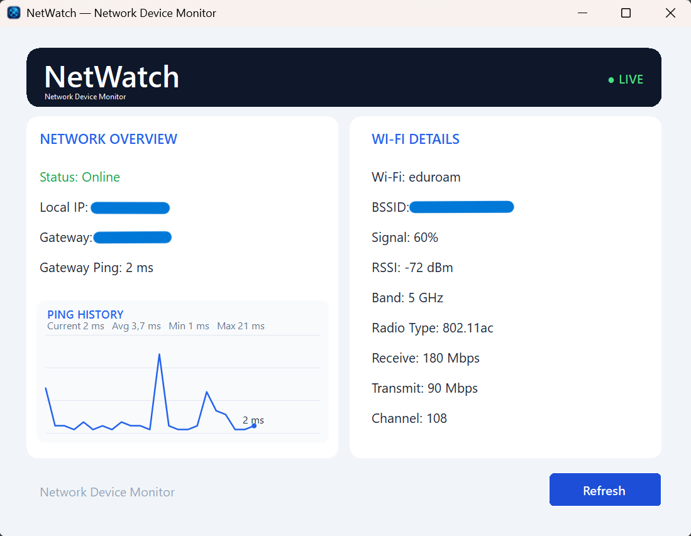

# NetWatch || 🌐

A modern network monitoring dashboard built with **C#**, **.NET**, and **Windows Forms**.

<p align="center">
  
</p>

NetWatch is a lightweight Windows desktop application designed to display useful local network and Wi-Fi connection information in a clean and modern interface.

## ✨ Highlights 

- Real-time network connection status
- Local IPv4 address detection
- Default gateway information
- Gateway latency monitoring
- Wi-Fi SSID information
- Access Point BSSID information
- Wi-Fi signal strength
- RSSI signal level
- Wi-Fi frequency band detection
- Wi-Fi channel information
- Wireless radio type detection
- Receive link rate
- Transmit link rate
- Manual network refresh
- Online/offline status indicators
- Modern WinForms dashboard interface
- Rounded card-based UI design

## 🛠️ Tech Stack

### Application
- **C#**
- **.NET**
- **Windows Forms (WinForms)**

### Network Tools
- `System.Net.NetworkInformation`
- `System.Net.Sockets`
- `System.Diagnostics`
- Windows `netsh`

## 🚀 Running the Project

### Requirements

Make sure the following are installed:

- Windows 10 or Windows 11
- Visual Studio with .NET Desktop Development workload
- .NET SDK compatible with the project target framework

### 1. Clone the repository

```powershell
git clone https://github.com/fatmaSsm/NetWatch.git
cd NetWatch

```
---

## 📬 Contact 

Fatma Susam 

[](https://github.com/fatmaSsm)
[](https://www.linkedin.com/in/fatma-susam/)

---
